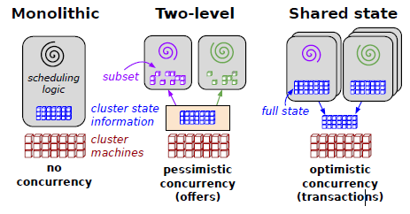
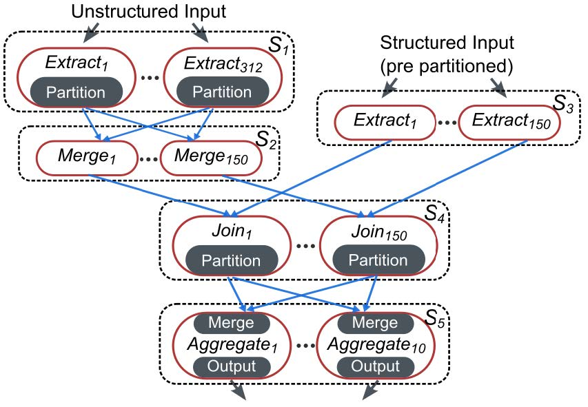

# OM-Assignments
Assignments for the operation and maintenance supervised under Rui Ren.

## Sigma

#### 系统架构

Sigma是阿里巴巴集团开发的一个集群调度和管理系统。它主要由三部分组成：

* Alikernel：这是Sigma系统的最底层，它可以在进行资源分配和时间片分配的时候提供优先级的调度和策略的调整，对任务的时延，任务时间片的抢占、不合理抢占的驱逐都能通过上层的规则配置自行决策。
* SigmaSlave：对于集群中的机器，SigmaSlave负责在单机上进行资源的分配，通过本机的调度对时延敏感任务快速做出决策和响应，避免因全局决策处理时间长带来的业务损失。
* SigmaMaster：在系统的最高层统揽全局，为大量的物理机和上面的容器的部署进行资源调度和算法优化。

#### Sigma和容器的协作

不同于市面上常见的Docker Container，Alibaba的系统架构中运用的容器主要为自研的[Pouch](https://github.com/alibaba/pouch)容器，在服务器集群的每个节点上都同时支持Sigma调度和[Fuxi](https://github.com/alibaba/pouch)调度，可以应对不同的需求和任务敏感度，但是保证了基础环境的统一，这种复杂但高效的调度系统和容器融合的架构被称为“混部架构”。

在Sigma调度时，首先通过SigmaAgent（前述的SigmaSlave的一部分）来启动一个被选中的Pouch容器，启动对应的计算任务，相关的调度和算法决策由Sigma Master完成。略微不同于Fuxi面对的调度需求的实现，Sigma Agent首先通过一个隔离层PouchContainer Daemon来间接对于提供服务操作的Pouch Container的调度。

#### Sigma和Fuxi的区别

Sigma和Fuxi都是阿里巴巴集团自主开发的运维系统，但是它们有着明显的不同：

* Sigma是基于阿里巴巴自主研发的Pouch Container来进行计算任务的分发的，而Fuxi系统则是直接面对线程上的任务分配的；
* Sigma是一个在线实时的资源调度系统，Fuxi则是一个离线的资源调度系统；
* Sigma主要负责电商、交易和搜索相关的事业部门，而Fuxi则负责和计算业务相关的逻辑任务。但是两个调度系统面对的资源和任务在混部架构的组织下，可以实现资源的互相借用，以实现更加弹性的资源扩容和缩容。

## Omega

#### 背景

Google的论文[《Omega flexible, scalable schedulers for large compute clusters》](https://ai.google/research/pubs/pub41684)中把调度分为3代，第一代是独立的集群，第二代是两层调度（mesos,YARN）第三带是共享状态调度。

#### 三类集群管理系统

##### 1. 中央式调度器（Monolithic scheduler）

中央式调度器的特点是，资源的调度和作业的管理功能全部放到一个进程中完成，开源界典型的代表是Hadoop JobTracker的实现。这种设计方式的缺点很明显，扩展性差：首先，集群规模受限，其次，新的调度策略难以融入现有代码中，比如之前仅支持MapReduce作业，现在要支持流式作业，而将流式作业的调度策略嵌入到中央式调度器中是一项很难的工作。

Omega论文中提到了一种对中央式调度器的优化方案：将每种调度策略放到单独一个路径（模块）中，不同的作业由不同的调度策略进行调度。这种方案在作业量和集群规模比较小时，能大大缩短作业相应时间，但由于所有调度策略仍在一个集中式的组件中，整个系统扩展性没有变得更好。

##### 2. 双层调度器（Two-level scheduler）

为了解决中央式调度器的不足，双层调度器是一种很容易想到的解决之道（实际上是分而治之策略或者是策略下放机制）。双层调度器仍保留一个经简化的中央式调度器，但调度策略下放到各个应用程序调度器完成。这种调度器的典型代表是Apache Mesos和Hadoop YARN。Omega论文重点介绍了[Mesos](http://dongxicheng.org/category/apache-mesos/)，[Mesos](http://dongxicheng.org/category/apache-mesos/)是twitter开源的资源管理系统。

[Mesos](http://dongxicheng.org/category/apache-mesos/)资源管理部分由两部分组成：分别是Mesos Master和Mesos Slave，其中，Mesos Slave是每个节点上的代理，负责向Master汇报信息和接收并执行来自Master的命令，而Master则是一个轻量级中央化的资源管理器，负责管理和分配整个集群中的资源。如果一个应用程序想通过Mesos资源管理系统申请和使用资源，需编写两个组件：框架调度器和框架执行器，其中，框架调度器负责从Mesos Master上获取资源、将资源分配给自己内部的各个应用程序，并控制应用程序的执行过程；而框架执行器运行在Mesos Slave中，负责运行该框架中的任务。当前很多框架可以接入Mesos中，包括Hadoop、MPI、Spark等

双层调度器的特点是，各个框架调度器并不知道整个集群资源使用情况，只是被动的接收资源；Mesos Master仅将可用的资源推送给各个框架，而框架自己选择使用还是拒绝这些资源；一旦框架（比如Hadoop JobTracker）接收到新资源后，再进一步将资源分配给其内部的各个应用程序（各个MapReduce作业），进而实现双层调度。

双层调度器的缺点是：

1. 各个框架无法知道整个集群的实时资源使用情况 
2. 采用悲观锁，并发粒度小

##### 3. 共享状态调度器（Shared State Scheduler）

为了克服双层调度器的以上两个缺点，Google开发了下一代资源管理系统Omega,Omega是一种基于共享状态的调度器，该调度器将双层调度器中的集中式资源调度模块简化成了一些持久化的共享数据（状态）和针对这些数据的验证代码，而这里的“共享数据”实际上就是整个集群的实时资源使用信息。一旦引入共享数据后，共享数据的并发访问方式就成为该系统设计的核心，而Omega则采用了传统数据库中基于多版本的并发访问控制方式（也称为“乐观锁”, MVCC, Multi-Version Concurrency Control），这大大提升了Omega的并发性。

由于Omega不再有集中式的调度模块，因此，不能像Mesos或者YARN那样，在一个统一模块中完成以下功能：对整个集群中的所有资源分组，限制每类应用程序的资源使用量，限制每个用户的资源使用量等，这些全部由各个应用程序调度器自我管理和控制，根据论文所述，Omega只是将优先级这一限制放到了共享数据的验证代码中，即当同时由多个应用程序申请同一份资源时，优先级最高的那个应用程序将获得该资源，其他资源限制全部下放到各个子调度器。 

Omega让资源邀约更进一步。在Mesos中，资源邀约是悲观的或独占的。如果资源已经提供给一个应用程序，同样的资源将不能提供给另一个应用程序，直到邀约超时。在Omega中，资源邀约是乐观的。每个应用程序可以请求群集上的所有可用资源，冲突在提交时解决。Omega的资源管理器基本上只是一个记录每个节点状态的关系数据库，使用不同类型的乐观并发控制解决冲突。这样的好处是大大增加了调度器的性能（完全并行）和更好的利用率。

引入多版本并发控制后，限制该机制性能的一个因素是资源访问冲突的次数，冲突次数越多，系统性能下降的越快，而google通过实际负载测试证明，这种方式的冲突次数是完全可以接受的。

#### Omega注意事项

* 服务性作业都较大，对（跨机架的）容错有更严格的配置需求。
* 由于在分配完全群集状态上的开销，Omega大概可以将调度器扩展到十倍，但是无法达到百倍。
* 秒级的调度时间是典型的。他们还比较了十秒级和百秒级的调度，这是两级调度的好处真正发挥作用的地方。无法确定这样的场景有多普遍，也许是由服务性作业来决定？
* 典型的集群利用率约为60％。
* 在OCC实践中，冲突非常罕见。在调度器崩溃之前，他们能够将正常批处理作业上升6倍。
* 增量调度是非常重要的。组调度明显更昂贵，因为要增加冲突处理的实现。显然，大多数的应用程序可以做好增量，通过实现部分资源分配进而达到他们所需的全额资源。
* 即使执行复杂的调度器（每作业十余秒的费），Omega仍然可以在合理的等待时间内调度一个混合的作业。
* 用一个新的MapReduce调度器进行实验，从经验上说，在Omega中会非常容易。

#### 关于Omega一些开放性问题

* 在某些时候，因为高冲突率和重试导致的重复工作，乐观并发控制会崩溃。在实践中好像没有碰到这种问题，但不清楚是否有奇形怪状的任务致使出现最坏的场景。这是受服务和批处理作业联合影响的吗？在实践中有做过什么调优吗？
* 是否缺乏真正可以接受的全局策略？如公平性、抢占等。
* 不同类型的作业调度的时间是多少？有人已经写出非常复杂的调度器吗？

## Apollo

 

---

 

#### Abstract 

有效地调度数据并行计算作业云计算集群对于工作至关重要性能，系统吞吐量和资源利率。随着成长，它变得越来越具有挑战性群集大小和更复杂的工作负载与多样化特点。本文对阿波罗进行了高度评价可扩展和协调的调度框架，其中已部署在Microsoft的生产群集上安排数以百万计的数千次计算任务高效，有效地成千上万机器每天。该框架执行调度决策

以分布式方式，利用全球集群信息通过松散协调的机制。每调度决策考虑未来资源可用性并优化各种性能和系统因素在一个统一的模型中一起。阿波罗很健壮,通过手段应对意想不到的系统动态，并且可以利用空闲的系统资源优雅的同时提供有保证的资源需要。

 

#### Characteristic

 

- **平衡可扩展性与调度质量**：Apollo采用分布式协调调度框架，通过结合同步集群利用率信息，做出独立的调度决策。这样的设计达到了正确的平衡：它避免了由完全分散的架构的独立调度员做出的次优（通常是冲突）决策，同时消除了集中式设计的可扩展性瓶颈和单点故障问题。

- **高质量的调度决策**：Apollo在服务器上安排任务的宗旨是最大限度的减少任务完成时间。Apollo估计模型包含各种因素，并允许调度程序执行加权决策，而不是单纯考虑数据位置或服务器负载。计算的数据并行性使得Apollo能够在作业执行期间从相似任务中得到的运行实时统计数据不断地修正对任务执行时间的估计。

- **为各个调度程序提供集群信息**：Apollo引入了一种轻量级的独立于硬件的机制来通告服务器上的负载。当与每个服务器上的本地任务队列结合使用时，该机制提供了所有服务器上近期的资源可用性视图。调度程序会在决策中使用到该视图。

- **妥善处理异常的运行行为**：Apollo通过一系列动态调整的纠正机制来使自身的鲁棒性得到保证。Apollo提出了一种独特的延迟校正机制，当独立调度程序之间的冲突造成较大影响时这一机制会介入。数据表明这种方法在实践中运行良好。

- **机会调度** ：Apollo引入了机会调度，有效地创建了两类任务：常规任务和机会任务。 Apollo确保常规任务的低延迟，同时使用机会性任务实现高利用率，以满足常规任务留下的冗余。 Apollo进一步使用基于令牌的机制来管理容量，并通过限制常规任务的总数来避免系统过载。

- **减少部署Apollo过程中带来的性能下降**：Apollo支持分阶段部署到生产集群并进行大规模验证。这些限制在研究中很少受到关注，但在实践中从来都不是至关重要的，Apollo开发团队分享了实现这些要求目标的经验。

 
#### Apollo Overview

 

-  A sample SCOPE execution graph

 

 

-  Apollo architectural overview

 

 

上图是Apollo的整体结构图。Job Manager（JM）就是一个调度器，它负责对作业进行调度，每一个集群都会拥有一个Resource Monitor（RM），每一台服务器都拥有一个Process Node（PN），它们两个协调工作来为调度器提供一个全局的视角，供调度器进行调度决策时使用。每个PN负责对本地服务器的资源进行管理，RM会从集群 中每个服务器上的PN那里收集信息，汇总成全局信息后给每个JM。 

 

 

 

#### Evaluations

 

 

 

 

 

 

- 上图显示了Apollo被部署6个月中每小时的峰值调度率，突出显示Apollo可以不断提供超过10,000的调度速率，在单个集群中达到每秒20,000个。这证实了对分布式调度基础设施的需求，因为任何单个调度器都难以以此速率做出高质量的决策。

 

 

 

 

- 实验团队深入研究了两周的时间并重新安装了Apollo。图7（a）显示了集群中并发运行的作业及其任务的数量，而图7（b）显示了同一时间段内的服务器CPU利用率，每10秒采样一次。 Apollo能够运行750个并发的复杂作业（140,000个并行常规任务），并在工作日需求高时实现90％以上的CPU利用率，从而达到集群的容量。图7（c）展示了常规任务和机会任务所分配到的CPU占比。

 

#### Conclusion

 

- 综合测试表明，Apollo能在微软的应用场景下提供出色的工作性能，同时具有高度的可扩展性。但是，Apollo对于运行时间的估计准确度受诸多因素影响，例如对于复杂的用户代码，其资源消耗和执行时间因输入的数据特征而异，在此情况下，Apollo的预测将会变得困难且不准确，尽管研发团队引入了动态调度决策，其调度质量和估计准确度还有待进一步的提升。研发团队也表示将在未来在此方面做进一步的研究与优化。

