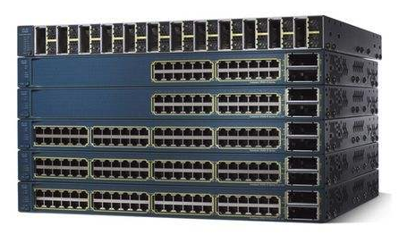

# Hardwares for Internet Platform

## Networks

###IPv4 & IPv6\*

随着世界互联网设备和节点规模的增加，诞生于[1981年](https://tools.ietf.org/html/rfc791)的[IPv4](https://zh.wikipedia.org/wiki/IPv4)(**I**nternet **P**rotocol **v**ersion **4**)]逐渐难以继续满足拓展性的需求,1998年IPv6被正式以[互联网标注规范](https://tools.ietf.org/html/rfc2460)的定义形式出台。相比较传统的IPv4，IPv6有许多显著的优点：

* 地址充足：IPv6产生的初衷主要是针对IPv4地址短缺问题，即从IPv4的32bit地址，扩展到了IPv6的128bit地址，充分解决了地址匮乏问题。同时IPv6地址是有范围的，包括链路本地地址、站点本地地址和任意传播地址，这也进一步增加了地址应用的扩展性。
* 操作简化：通过简化固定的基本报头、采用64比特边界定位、取消IP头的校验和域等措施，以提高网络设备对IP报文的处理效率。
* 扩展为先：引入灵活的扩展报头，按照不同协议要求增加扩展头种类，按照处理顺序合理安排扩展头的顺序，其中网络设备需要处理的扩展头在报文头的前部，而需要宿端处理的扩展头在报文头的尾部。
* 层次区划：IPv6极大的地址空间使层次性的地址规划成为可能，同时国际标准中已经规定了各个类型地址的层次结构，这样既便于路由的快速查找，也有利于路由聚合，缩减IPv6路由表大小，降低网络地址规划的难度。

*\*两者的详细比较内容可见[IPv4 与 IPv6 的比较 (IBM knowledge Center)](https://www.ibm.com/support/knowledgecenter/zh/ssw_ibm_i_72/rzai2/rzai2compipv4ipv6.htm)*

### 交换机(Switch)和路由器(Router)

####交换机的性能指标

**交换机**是一种基于MAC地址识别，能完成封装转发数据包功能的网络设备。它可以为接入交换机的任意两个[网络节点](https://baike.baidu.com/item/%E7%BD%91%E7%BB%9C%E8%8A%82%E7%82%B9/9338583)提供独享的电信号通路。最常见的交换机是[以太网交换机](https://baike.baidu.com/item/%E4%BB%A5%E5%A4%AA%E7%BD%91%E4%BA%A4%E6%8D%A2%E6%9C%BA/10186103)。其他常见的还有电话语音交换机、[光纤交换机](https://baike.baidu.com/item/%E5%85%89%E7%BA%A4%E4%BA%A4%E6%8D%A2%E6%9C%BA/8396782)等。它主要的性能指标有：

* 背板带宽（ BackPlane Capacity ）：背板带宽是模块化交换机专有的概念。它是指交换机背板总线的带宽，是由机箱（ Chassis ）所决定的。背板带宽代表了引擎与业务板之间所能传输的最大数据量，单位为 Gbps 。

* 交换容量（ Switch Capability ）：指引擎 / 交换矩阵或转发芯片的交换能力。与背板带宽一样，单位也是 Gbps 。交换容量与背板带宽的区别在于：交换容量是描述的引擎等有源部件，背板带宽描述的是无源部件――背板总线。对于固定配置交换机而言，因为其没有背板总线，固没有背板带宽这一概念。对于模块化交换机，背板带宽由机箱决定，交换矩阵由引擎决定。举个例子， Cisco 6506-E 机箱的背板带宽是 480Gbps ， SUP720 引擎的交换容量是 720Gbps ，所以若 6506-E机箱配备 SUP720 引擎，它的总带宽也只能是 480Gbps 。
* 包转发率（ Throughout ）：指在加载负荷的情况下，设备能成功转发数据的效率。所谓成功转发，仅表示不丢包，不表示不出错。在描述一个设备的包转发率时必须指明是在多大的加载负荷情况下的值，业界一般选用 64byte 的包作为加载负荷。不同厂商对包转发率有不同的称谓，比如转发速率、吞吐率、转发性能、每秒分组数等等。

#### 路由器的性能指标

作为一种网络基础设备，路由器提供[路由](https://zh.wikipedia.org/wiki/%E8%B7%AF%E7%94%B1)与[转送](https://zh.wikipedia.org/w/index.php?title=%E8%BD%89%E9%80%81&action=edit&redlink=1)两种重要机制，可以决定[封包](https://zh.wikipedia.org/wiki/%E5%B0%81%E5%8C%85)从来源端到目的端所经过的路由路径（host到host之间的传输路径），这个过程称为路由；将路由器输入端的封包移送至适当的路由器输出端（在路由器内部进行），这称为转送。路由工作在[OSI模型](https://zh.wikipedia.org/wiki/OSI%E6%A8%A1%E5%9E%8B)的第三层——即[网络层](https://zh.wikipedia.org/wiki/%E7%BD%91%E7%BB%9C%E5%B1%82)，例如[网际协议](https://zh.wikipedia.org/wiki/%E7%BD%91%E9%99%85%E5%8D%8F%E8%AE%AE)（IP）

* 计算能力（Computation Capacity）：路由器的计算能力一般由CPU和ASIC完成，通常在中低端路由器中，CPU负责交换路由信息、路由表查找以及转发数据包。在上述路由器中，CPU的能力直接影响路由器的吞吐量（路由表查找时间）和路由计算能力（影响网络路由收敛时间）。在高端路由器中，通常包转发和查表由ASIC芯片完成，CPU只实现路由协议、计算路由以及分发路由表。由于技术的发展，路由器中许多工作都可以由硬件实现（专用芯片）。CPU性能并不完全反映路由器性能。路由器性能由路由器吞吐量、时延和路由计算能力等指标体现。

* 路由协议支持：

  路由器的路由功能常常基于不同的路由协议:

  * 路由信息协议(RIP):RIP是基于距离向量的路由协议，通常利用跳数来作为计量标准。RIP是一种内部网关协议。由于RIP实现简单，是使用范围最广泛的路由协议。该协议收敛较慢，一般用于规模较小的网络。RIP协议在RFC 1058规定。
  * 路由信息协议版本2 (RIPv2):该协议是RIP的改进版本，允许携带更多的信息，并且与RIP保持兼容。在RIP基础上增加了地址掩码（支持CIDR）、下一跳地址、可选的认证信息等内容。该版本在RFC 1723中规范化。
  * 开放最短路径优先协议版本2 (OSPFv2):该协议是一种基于链路状态的路由协议，由IETF内部网关协议工作组专为IP开发，作为RIP的后继内部网关协议。OSPF的作用在于最小代价路由、多相同路径计算和负载均衡。OSPF拥有开放性和使用SPF算法两大特性。
  * “中间系统－中间系统”协议(ISIS):ISIS协议同样是基于链路状态的路由协议。该协议由ISO提出，起初用于OSI网络环境，后修改成可以在双重环境下运行。该协议与OSPF协议类似，可用于大规模IP网作为内部网关协议。
  * 边缘网关协议(BGP4):BGP协议是用于替代EGP的域间路由协议。BGP4是当前IP网上最流行的也是唯一可选的自治域间路由协议。该版本协议支持CIDR，并且可以使用路由聚合机制大大减小路由表。BGP4协议可以利用多种属性来灵活地控制路由策略。
  * 802.3、802.1Q的支持:802.3是IEEE针对以太网的标准。支持以太网接口的路由器必须符合802.3协议。802.1Q是IEEE对虚拟网的标准。符合802.1Q的路由器接口可以在同一物理接口上支持多个VLAN。
  * 对IPv6的支持和对IP以外协议的支持：除支持IP协议外，路由器设备还可以支持IPX、DECNet、AppleTalk等协议。这些协议在国外有一定应用，在我国应用较少，一般不用考虑。

* 核心性能指标：
  * 全双工线速转发能力：路由器最基本且最重要的功能是数据包转发。在同样端口速率下转发小包是对路由器包转发能力最大的考验。全双工线速转发能力是指以最小包长（以太网64字节、POS口40字节）和最小包间隔（符合协议规定）在路由器端口上双向传输同时不引起丢包。该指标是路由器性能重要指标。
  * 设备吞吐量：指设备整机包转发能力，是设备性能的重要指标。路由器的工作在于根据IP包头或者MPLS标记选路，所以性能指标是转发包数量每秒。设备吞吐量通常小于路由器所有端口吞吐量之和。
  * 端口吞吐量：端口吞吐量是指端口包转发能力，通常使用pps：包每秒来衡量，它是路由器在某端口上的包转发能力。通常采用两个相同速率接口测试。但是测试接口可能与接口位置及关系相关。例如同一插卡上端口间测试的吞吐量可能与不同插卡上端口间吞吐量值不同。
  * 背靠背帧数：背靠背帧数是指以最小帧间隔发送最多数据包不引起丢包时的数据包数量。该指标用于测试路由器缓存能力。有线速全双工转发能力的路由器该指标值无限。
  * 丢包率：丢包率是指测试中所丢失数据包数量占所发送数据包的比率，通常在吞吐量范围内测试。丢包率与数据包长度以及包发送频率相关。在一些环境下可以加上路由抖动、大量路由后测试。

#### 路由器和交换机的比较

路由器和交换机在诸多功能功能上都有互相的覆盖，但是它们在网络平台的基础设施中却仍然是完全不同的独立角色，它们的共同点和不同点总结如下：

* 交换机是一根网线上网，但是大家上网是分别拨号，各自使用自己的宽带，大家上网没有影响。而路由器比交换机多了一个虚拟拨号功能，通过同一台路由器上网的电脑是共用一个宽带账号，大家上网要相互影响。
* 交换机工作在中继层，交换机根据MAC地址寻址。路由器工作在网络层，根据IP地址寻址，路由器可以处理TCP/IP协议，而交换机不可以。
* 路由器提供防火墙的服务，交换机不能提供该功能。集线器、交换机都是做端口扩展的，就是扩大局域网(通常都是以太网)的接入点，也就是能让局域网可以连进来更多的电脑。路由器是用来做网间连接，也就是用来连接不同的网络。
* 交换机可以使连接它的多台电脑组成局域网，如果还有代理服务器的话还可以实现同时上网功能而且局域网所有电脑是共享它的带宽速率的，但是交换机没有路由器的自动识别数据包发送和到达地址的功能。路由器可以自动识别数据包发送和到达的地址，路由器相当于马路上的警察，负责交通疏导和指路的。

### 子网(SubNet)

[IPv4](https://zh.wikipedia.org/wiki/IPv4)地址被分为三部分：网络部分（network）、子网部分（subnetwork，现在常被认为是网络部分的一部分——尽管它本来是“rest”部分的一部分）和主机（host）部分。共有三[类](https://zh.wikipedia.org/wiki/%E5%88%86%E7%B1%BB%E7%BD%91%E7%BB%9C)IP地址，它们分别指定了各部分占多少位。

#### 子网掩码(subnet mask)

是一种用来指明一个[IP地址](https://zh.wikipedia.org/wiki/IP%E5%9C%B0%E5%9D%80)的哪些位标识的是主机所在的网络地址以及哪些位标识的是主机地址的[位掩码](https://zh.wikipedia.org/wiki/%E6%8E%A9%E7%A0%81)。

通常情况下，子网掩码的表示方法和地址本身的表示方法是一样的。在IPv4中，就是点分十进制四组表示法（四个取值从0到255的数字由点隔开，比如255.128.0.0）或表示为一个八位十六进制数（如FF.80.00.00，它等同于255.128.0.0），后者用得较少。

另一种更为简短的形式叫做[无类别域间路由](https://zh.wikipedia.org/wiki/%E6%97%A0%E7%B1%BB%E5%88%AB%E5%9F%9F%E9%97%B4%E8%B7%AF%E7%94%B1)（CIDR）表示法，它给出的是一个地址加上一个斜杠以及网络掩码的二进制表示法中“1”的位数（即网络号中和网络掩码相关的是哪些位）。例如，192.0.2.96/28表示的是一个前28位被用作网络号的IP地址（和255.255.255.240的意思一样）。

子网掩码的好处就是：不管网络有没有划分子网，只要把子网掩码和IP地址进行逐位的“与”运算（AND）即得出网络地址来。这样在路由器处理到来的分组时就可以采用同样的方法。[[1\]](https://zh.wikipedia.org/wiki/%E5%AD%90%E7%BD%91#cite_note-1)

### DNS服务器 (DNS Server)

#### 技术介绍

DNS（Domain Name Server，域名服务器）是进行域名(domain name)和与之相对应的IP地址 (IP address)转换的服务器。DNS中保存了一张域名(domain name)和与之相对应的IP地址 (IP address)的表，以解析消息的域名。 域名是Internet上某一台计算机或计算机组的名称，用于在数据传输时标识计算机的电子方位（有时也指地理位置）。

DNS服务器和DNS Client配合工作，对于域名和对应的IP地址信息进行查询和传递，其中运用到的技术有：

* 查询模式：
  * 递归查询模式（Recursive Query）：一般发生于client向DNS server提交域名解析请求后，SERVER首先查询本身有没有对应的记录，如果有就返回查询的结果，否则代替client向其他的DNS Server发送域名解析请求，并且返回结果；
  * 迭代查询模式（Interative Query）：DNS Server会向Client发送可以进行类似解析工作的其他DNS Server的地址，而不直接回复结果，Client可以再次向其他的DNS Server发送解析请求。
* 域名解析技术：
  * 静态域名解析：Internet上的域名解析一般是静态的，即一个域名所对应的IP地址是静态的，长期不变的。也就是说，如果要在Internet上搭建一个网站，需要有一个固定的IP地址。 
  * 动态域名解析：动态[域名解析](https://baike.baidu.com/item/%E5%9F%9F%E5%90%8D%E8%A7%A3%E6%9E%90)服务，是将用户的[动态IP地址](https://baike.baidu.com/item/%E5%8A%A8%E6%80%81IP%E5%9C%B0%E5%9D%80)映射到一个固定的域名解析服务上，用户每次连接网络的时候，客户端程序就会通过信息传递把该[主机](https://baike.baidu.com/item/%E4%B8%BB%E6%9C%BA/455151)的动态IP地址传送给位于服务商主机上的服务器程序，服务程序负责提供DNS服务并实现动态域名解析。就是说DDNS捕获用户每次变化的IP地址，然后将其与域名相对应，这样域名就可以始终解析到非固定IP的服务器上，互联网用户通过本地的[域名服务器](https://baike.baidu.com/item/%E5%9F%9F%E5%90%8D%E6%9C%8D%E5%8A%A1%E5%99%A8/9705133)获得网站域名的IP地址，从而可以访问网站的服务。

#### DNS服务的优化

在DNS服务的实现中，存在着许多的优化技术，也带来了相应的tradeoff：

* Cache的使用：对于许多域名，一台DNS server都会在短时间内接收到重复的解析请求，这个时候如果还去进行一层层的域名解析，会带来许多不必要的时间负担，所以许多的低层DNS解析节点上也都会保存有一些cache，在接收到对应得以域名解析请求的时候可以进行快速的结果返回；

* 对根服务器的依赖：公用的DNS服务器往往可以追根溯源到十多台“根服务器”上，它们一般负责顶级域名字段的解析，之后分发次级域名的解析给下层的DNS server，这种操作形成了一个树形的结构，但是类似于Cache等技术可以在解析域名的过程中减少对于根服务器的依赖；

  

* 私有DNS Server：因为本质上DNS Server的工作可以通过一个字典文件来替代，所以建立一个DNS Server并不是一个特别复杂的工作。因此，也有所谓的私有DNS Server的存在，而另一方面，诱导他人的设备将这些DNS Server作为选中的DNS服务器也会给他人的网络访问带来风险，或者允许"DNS Pollution"攻击的存在。

### 总结

可以说，寻求更快、并发更高、可拓展性的网络方案是一个持续的话题。一般来说，在路由器、交换机等设备上采用更高的性能标准并不会带来技术上的明显副作用，所以tradeoff往往只存在于考虑到具体预算和设计兼容性的时候。但是对于网络环境的构建，往往需要定制化的工作，特别是对于很常见的内网外网隔离的需求或者对于proxy转发等需求。

另一方面，在互联网环境中，特别是IPv4中，IP地址是一个很稀缺的资源，这个时候还可以通过内网的地址拓展来满足自己系统内的对于“独立”IP地址的需求，此时整个内网环境成为了一个整理，暴露给外界的IP地址尽管很少，但是自己内部的虚拟地址却可以得到扩充，这种方法几乎被所有机构和组织的网络管理策略所采用。